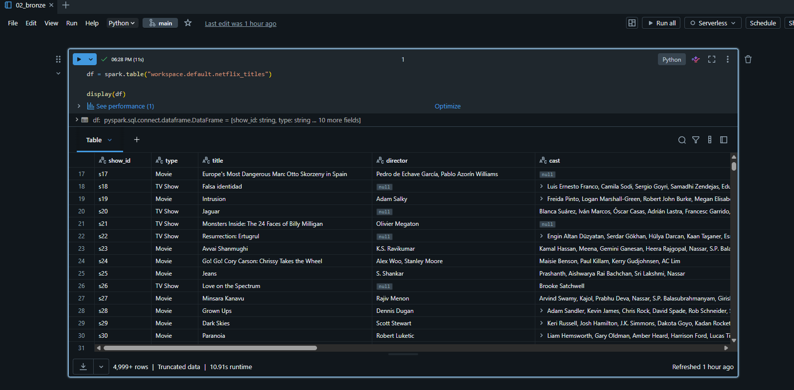
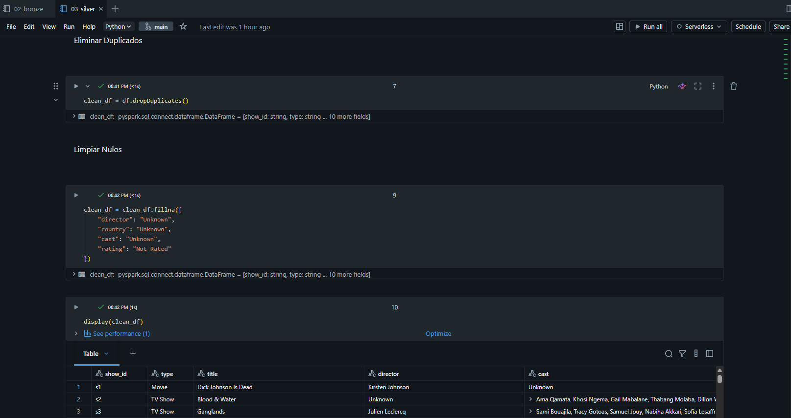
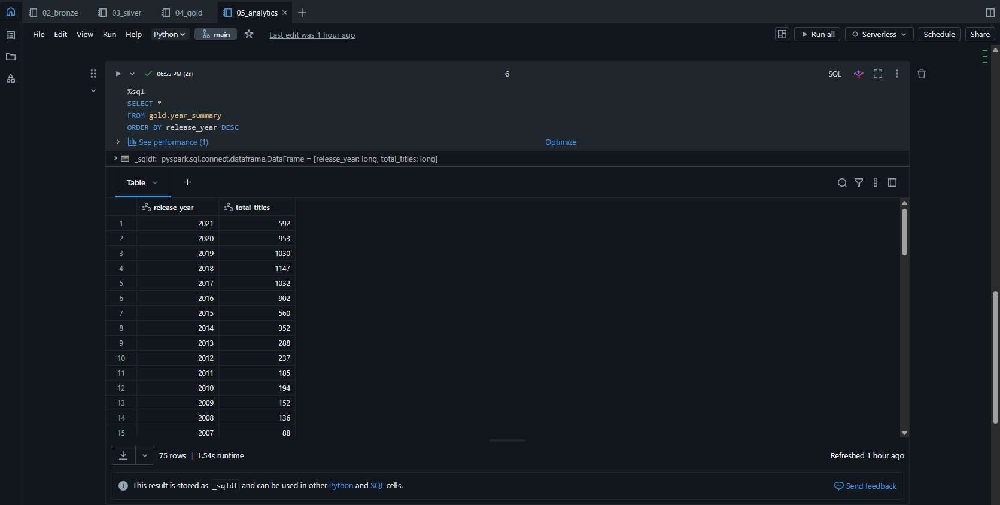

# Netflix Data Engineering Project

## Overview

End-to-end Data Engineering project built using Databricks, PySpark, Delta Lake and Medallion Architecture.

This project demonstrates:
- Data ingestion
- ETL pipelines
- Data cleaning
- Delta tables
- SQL analytics
- Dashboard creation

---

## Architecture

RAW → Bronze → Silver → Gold

---

## Technologies Used

- Databricks
- PySpark
- Spark SQL
- Delta Lake
- GitHub

---

## Pipeline Layers

### Bronze Layer
Raw ingested Netflix dataset.

### Silver Layer
Cleaned and transformed data:
- removed duplicates
- handled null values
- standardized fields

### Gold Layer
Business KPIs and analytics:
- content by country
- movies vs TV shows
- releases by year

---

## Dashboard

Analytics dashboard created in Databricks SQL.

---

## Project Screenshots

### Dashboard

### Bronze Layer

### Silver Cleaning

### Gold Analytics

---

## Author

Kevin Sterling
